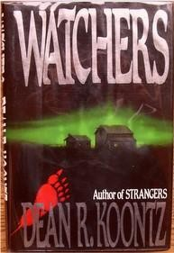

# fw

[](https://babashka.org)
[](https://clojars.org/baby.pat/fw)   
Simple file-watcher allowing Babashka/JVM Clojure clients to share a consistent NS/API.

---
[](https://fw.pat.baby)
   
Uses [NextJournal's Beholder](https://github.com/nextjournal/beholder) on the JVM.   
Uses [Babashka's FS-Watcher Pod](https://github.com/babashka/pod-babashka-fswatcher) on BB.

## Installation

```clojure
baby.pat/fw {:mvn/version "0.0.2"}
```

## Usage

```clojure
(require '[baby.pat.fw :as fw])
(def watcher (fw/watch "src" prn))
(fw/kill-watcher! watcher)
```

## Usage Notes
The filewatcher on babashka can by annoying. It want's to return type as CHMOD often. Outside of that behavior I've made a naive attempt at consistent behavior on both evaluation targets.   
